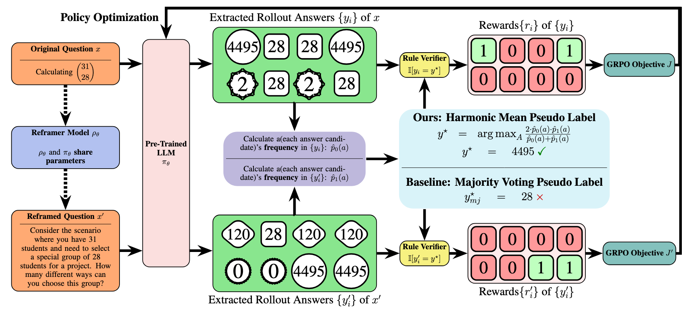

<div align="center">

# 🎵 Self-Harmony

### Learning to Harmonize Self-Supervision and Self-Play in Test-Time Reinforcement Learning

[](https://openreview.net/forum?id=ZzG6oJ5ehI)
[](https://arxiv.org/abs/2511.01191)
[](LICENSE)
[](#-main-results)
[](#-quick-start)
[](mailto:ru.wang@weblab.t.u-tokyo.ac.jp)

**Ru Wang, Wei Huang, Qi Cao, Yusuke Iwasawa, Yutaka Matsuo, Jiaxian Guo**

</div>

---

## 📌 Overview

**Self-Harmony** is a novel test-time reinforcement learning (TTRL) framework that enables LLMs to improve their reasoning capabilities *without any human-labeled data*. Unlike standard approaches that rely on majority voting—which often collapses to spurious yet popular answers—Self-Harmony constructs reliable learning signals through a **solve → reframe → solve** paradigm.

The core intuition is simple yet powerful: **a correct answer should remain stable across both an original question and its paraphrase**. Self-Harmony employs a single model in two complementary roles:

| Role           | Description                                                  |
| -------------- | ------------------------------------------------------------ |
| 🧩 **Solver**   | Generates candidate answers for the given problem            |
| 🔄 **Reframer** | Rephrases the input question to create an alternative "view" |

Answer frequencies across original and reframed views are aggregated using the **harmonic mean**, which naturally selects for solutions that are stable under reframing—avoiding view-dependent, spurious answers.

### ✨ Key Results

- 🏆 **State-of-the-art** in label-free test-time settings across diverse reasoning benchmarks
- 🥇 **Ranked #1 in 28 out of 30 settings** across multiple methods
- 🛡️ **Zero training failures** across all experiments—unprecedented robustness
- 🚫 **No human supervision or auxiliary models** required

---

## 🏗️ Framework

<p align="center">
  
</p>

### 💡 Implementation Trick: Two-Branch Generation

While the conceptual framework follows a three-step **solve → reframe → solve** sequence, executing three separate model calls is computationally expensive. We optimize this into **two parallel branches**:

| Branch                             | Description                                                                                                                                                           |
| ---------------------------------- | --------------------------------------------------------------------------------------------------------------------------------------------------------------------- |
| 🧩 **Solver** (Branch 1)            | Generates candidate answers for the **original** question                                                                                                             |
| 🔄 **Reframer + Solver** (Branch 2) | **Fuses** reframing and solving into a **single generation** — the model first paraphrases the question, then immediately solves its own paraphrase in one trajectory |

This fusion reduces the pipeline from **3 model calls to 2**, making Self-Harmony both practical and scalable. Each branch produces answers that are then aggregated via the harmonic mean consensus to select the pseudo-label.

> [!TIP]
> The joint "reframe-and-solve" branch is implemented via a specially designed **system prompt** that instructs the model to first transform the problem using a creative strategy (e.g., *Concretize*, *Generalize*, *Domain Shift*), then solve the transformed version—all within a single generation pass.

```
Branch 1 (Solver):           Question ──→ [Solve] ──→ Answer
Branch 2 (Reframer+Solver):  Question ──→ [Reframe + Solve] ──→ Answer'
                                              ↓
                             Harmonic Mean Consensus → Pseudo-label y*
```

### 🔍 Why Harmonic Mean? — Interpretation of Our Pseudo-Label

The harmonic mean can be decomposed as follows:

$$
\text{Harmonic Mean} = \frac{2\, p_{0}(a)\, p_{1}(a)}{p_{0}(a) + p_{1}(a)} = \frac{1}{2} \Biggl[ \underbrace{\color{green}{p_{0}(a) + p_{1}(a)}}_{\text{Self-Consistency}} - \underbrace{\color{blue}{\frac{(p_{0}(a) - p_{1}(a))^2}{p_{0}(a) + p_{1}(a)}}}_{\text{View Invariance}} \Biggr]
$$

This decomposition provides a clear interpretation of the harmonic mean pseudo-labeling objective:

- 🟢 **Self-Consistency** — The first term rewards high overall confidence from both views, analogous to maximizing the likelihood under view-agnostic aggregation.
- 🔵 **View Invariance** — The second term penalizes disagreement between views, acting as a view-invariance regularizer.

Thus, the harmonic mean simultaneously prefers labels that are **(i) confident according to both views** and **(ii) consistent across views**, rather than being disproportionately influenced by a single overconfident but unreliable prediction.

---

## 🧩 Unified Pseudo Code

The following unified pseudo-code covers the **Self-Harmony** algorithm along with its **Multi-View** and **Weighted Prior** generalizations ($K$ views, non-uniform weights $\pi(v_k)$, and consistency regularization $\lambda$).

```python
# Algorithm: Unified Self-Harmony
# Covers: Standard, Multi-View, Weighted, and Lambda-adjusted variants

def unified_self_harmony(model, dataset, views=["solver", "reframer"], 
                        priors=None, lambda_val=1.0, T=TotalSteps):
    """
    Unified Self-Harmony Algorithm
    Args:
        views: List of roles/prompts defining the views (default: 2 views)
        priors: List of weights w_k for each view (default: Uniform [1/K]*K)
        lambda_val: Consistency penalty coefficient (default: 1.0)
    """
    if priors is None:
        priors = [1.0 / len(views)] * len(views) # Uniform Prior
        
    theta = model.parameters
    
    for t in range(T):
        buffer = []
        for x in dataset:
            all_view_answers = []
            
            # --- Multi-View Generation ---
            for k, view in enumerate(views):
                # Generate N answers from k-th view
                # (e.g., via specific prompt or role)
                ans_k = model.generate(x, view=view, n=N)
                all_view_answers.append(ans_k)
            
            # --- Weighted Invariant Score Consensus ---
            # Select pseudo-label y* maximizing the generalized score
            # Score(y) ≈ WeightedArithmeticMean(y) - lambda * Variance(y)
            # This is efficiently implemented via Weighted Harmonic Mean
            y_star = weighted_harmonic_mean(
                all_view_answers, 
                weights=priors, 
                lambda_param=lambda_val
            )
            
            # Store experience
            buffer.append((x, y_star))
            
        # --- Optimization ---
        # Update model to maximize likelihood of y_star
        loss = compute_loss(model, buffer)
        theta = update_parameters(loss)
            
    return theta

def weighted_harmonic_mean(all_view_answers, weights, lambda_param=1.0):
    """
    Computes generalized consistency score:
    Score(y) = ArithmeticMean(y) - lambda * ConsistencyPenalty(y)
    
    If lambda=1.0, this approximates the standard Harmonic Mean.
    """
    candidates = unique(all_view_answers)
    best_y = None
    max_score = -infinity
    
    for y in candidates:
        # Calculate weighted arithmetic mean (confidence)
        # p_k(y) is the frequency of answer y in view k
        arithmetic_mean = sum(w * p_k(y) for w, p_k in zip(weights, views))
        
        # Calculate weighted variance (inconsistency)
        variance = sum(w * (p_k(y) - arithmetic_mean)**2 for w, p_k in zip(weights, views))
        
        # Combined Score
        score = arithmetic_mean - lambda_param * variance
        
        if score > max_score:
            max_score = score
            best_y = y
            
    return best_y
```

---

## 🧠 Extended Theory

We extend the Self-Harmony framework to broader theoretical settings, including multi-view consistency and flexible consistency regularization.

### 🌐 Generalized Multi-View Consistency

While the main framework uses two views (Solver and Reframer), Self-Harmony generalizes to $K$ arbitrary views $\{v_1, \dots, v_K\}$ (e.g., diverse prompts, different reasoning paths, or heterogeneous models). The generalized consistency score uses the weighted harmonic mean:

$$
\text{Score}(y) = \frac{\sum_{k=1}^K w_k}{\sum_{k=1}^K \frac{w_k}{p(y|v_k)}}
$$

where $w_k$ represents the reliability or confidence of the $k$-th view. This handles **imbalanced views** where certain perspectives may be more trustworthy than others.

### 🎛️ The $\lambda$ Parameter: Balancing Confidence and Consistency

The harmonic mean can be viewed as a special case of a broader objective that balances arithmetic aggregation and variance reduction. For two views with probabilities $p_0$ and $p_1$:

$$
\mathcal{J}_\lambda(y) = \underbrace{\frac{p_0(y) + p_1(y)}{2}}_{\text{Arithmetic Mean}} - \lambda \cdot \underbrace{\frac{(p_0(y) - p_1(y))^2}{2(p_0(y) + p_1(y))}}_{\text{Consistency Penalty}}
$$

- **$\lambda = 1$**: Recovers the **Harmonic Mean**, strictly penalizing inconsistency.
- **$\lambda = 0$**: Recovers the **Arithmetic Mean** (Standard Self-Consistency/Majority Voting), ignoring view disagreement.
- **$\lambda > 1$**: Enforces stronger consistency constraints, useful for highly unreliable models requiring strict agreement.

### ⚖️ Non-Uniform Prior & Weighted Invariant Score

In the appendix, we explore scenarios where view reliability is non-uniform (e.g., the *Original* view is known to be more accurate than the *Reframed* view). We introduce a **Non-Uniform Prior** $\pi(v)$ over views. The resulting **Weighted Invariant Score** incorporates these priors:

$$
\mathcal{J}(y) \approx \underbrace{\mathbb{E}_{\pi}[\hat{p}(y|v)]}_{\text{Weighted Confidence}} - \lambda \cdot \underbrace{\text{Var}_{\pi}[\hat{p}(y|v)]}_{\text{Weighted Variance}}
$$

---

## 📊 Main Results

> **Self-Harmony** consistently outperforms baseline methods across most tested models and datasets, demonstrating both superior performance and training stability. The **best** and <ins>second-best</ins> results are highlighted. If a baseline's performance degrades significantly after its peak, we report the highest score observed across validation steps and mark it with an asterisk (\*), while *Self-Harmony* uses the score at the final step.

<details open>
<summary><b>Qwen3-1.7B-Base</b></summary>

| Methods         |     MATH500      |      GSM8K       |    AIME 2024    |       AMC        |       GPQA       |     MMLU-Pro     |
| :-------------- | :--------------: | :--------------: | :-------------: | :--------------: | :--------------: | :--------------: |
| Before RL       |      42.70       |      65.58       |      3.33       |      26.50       |      20.30       |      16.61       |
| GT-Reward       |      71.80       |      85.97       |      20.83      |      53.01       |      53.80       |      85.71       |
| Intuitor        |     51.12\*      |     80.25\*      |     3.75\*      |     23.56\*      |     23.76\*      |     31.25\*      |
| Rent            |      61.08       |     78.64\*      |     6.45\*      |     32.00\*      |     23.47\*      |     18.04\*      |
| Majority-Voting |      64.64       |      83.80       | <ins>9.37</ins> |      37.65       | <ins>24.68</ins> |      44.82       |
| Co-Reward       | <ins>64.67</ins> | <ins>86.59</ins> |      6.67       | <ins>39.75</ins> |      23.66       | <ins>47.14</ins> |
| *Self-Harmony*  |    **69.60**     |    **87.47**     |    **10.00**    |    **40.51**     |    **27.92**     |    **53.66**     |

</details>

<details open>
<summary><b>Qwen3-4B-Base</b></summary>

| Methods         |     MATH500      |      GSM8K       | AIME 2024 |       AMC        |       GPQA       |      MMLU-Pro      |
| :-------------- | :--------------: | :--------------: | :-------: | :--------------: | :--------------: | :----------------: |
| Before RL       |      60.20       |      55.72       |   6.66    |      34.94       |      16.75       |       27.59        |
| GT-Reward       |      83.40       |      94.69       |   50.00   |      86.74       |      92.89       |       92.85        |
| Intuitor        |     72.35\*      |     87.53\*      |  10.41\*  |     43.59\*      |     32.39\*      |      64.55\*       |
| Rent            |      74.60       |     90.49\*      |  12.08\*  |     45.25\*      |     31.78\*      | <ins>66.16\*</ins> |
| Majority-Voting |      75.75       |      93.44       | **20.00** | <ins>49.32</ins> | <ins>36.51</ins> |       52.95        |
| Co-Reward       | <ins>76.54</ins> | <ins>93.47</ins> |   12.71   |      46.98       |      24.36       |      51.79\*       |
| *Self-Harmony*  |    **78.50**     |    **94.31**     | **20.00** |    **49.40**     |    **37.06**     |     **67.68**      |

</details>

<details open>
<summary><b>Qwen3-8B-Base</b></summary>

| Methods         |     MATH500      |      GSM8K       |    AIME 2024     |       AMC        |       GPQA       |     MMLU-Pro     |
| :-------------- | :--------------: | :--------------: | :--------------: | :--------------: | :--------------: | :--------------: |
| Before RL       |      66.80       |      84.76       |      10.00       |      45.78       |      33.44       |      50.09       |
| GT-Reward       |      84.72       |      96.51       |      56.66       |      87.95       |      93.40       |      92.85       |
| Intuitor        |     78.77\*      |     92.28\*      |     17.08\*      |     51.65\*      |     31.56\*      |      60.54       |
| Rent            |     77.26\*      |     91.20\*      |     18.54\*      |     50.82\*      |     37.88\*      |     69.91\*      |
| Majority-Voting | <ins>78.99</ins> |      94.00       |    **24.16**     | <ins>59.03</ins> |    **39.34**     | <ins>77.58</ins> |
| Co-Reward       |      78.92       | <ins>94.80</ins> |      15.83       |      51.80       |      24.42       |     57.59\*      |
| *Self-Harmony*  |    **80.00**     |    **95.45**     | <ins>23.33</ins> |    **59.04**     | <ins>38.07</ins> |    **77.68**     |

</details>

<details open>
<summary><b>Llama-3.2-3B-Instruct</b></summary>

| Methods         |     MATH500      |      GSM8K       | AIME 2024 |    AMC    |       GPQA       |      MMLU-Pro      |
| :-------------- | :--------------: | :--------------: | :-------: | :-------: | :--------------: | :----------------: |
| Before RL       |      39.80       |      16.65       |   6.67    |   19.27   |       3.04       |       34.11        |
| GT-Reward       |      69.80       |      93.70       |   33.33   |   83.13   |      89.34       |       72.85        |
| Intuitor        |     47.78\*      |     16.73\*      |  9.16\*   |  23.79\*  |      3.23\*      |      34.64\*       |
| Rent            |     47.30\*      |     16.67\*      |  7.70\*   |  23.79\*  |      2.79\*      |      34.38\*       |
| Majority-Voting |      46.38       |      85.98       | **13.33** |   20.48   | <ins>22.33</ins> |       31.43        |
| Co-Reward       | <ins>55.22</ins> | <ins>89.14</ins> | **13.33** | **25.30** |      19.79       | <ins>34.02\*</ins> |
| *Self-Harmony*  |    **55.40**     |    **89.55**     | **13.33** | **25.30** |    **29.95**     |     **44.29**      |

</details>

<details open>
<summary><b>Llama-3.1-8B-Instruct</b></summary>

| Methods         |      MATH500       |      GSM8K       |     AIME 2024     |        AMC         |       GPQA       |      MMLU-Pro      |
| :-------------- | :----------------: | :--------------: | :---------------: | :----------------: | :--------------: | :----------------: |
| Before RL       |       41.46        |      60.48       |       3.33        |       20.48        |      14.72       |       43.75        |
| GT-Reward       |       73.60        |      95.60       |       33.33       |       80.72        |      89.84       |       91.42        |
| Intuitor        | <ins>48.37\*</ins> |     66.25\*      | <ins>6.45\*</ins> |       6.62\*       |     15.32\*      |      40.00\*       |
| Rent            |      45.98\*       |     69.88\*      |      3.95\*       | <ins>21.98\*</ins> |     14.56\*      |      40.80\*       |
| Majority-Voting |      46.71\*       |     88.78\*      |       4.13        |       21.53        | <ins>25.31</ins> | <ins>45.36\*</ins> |
| Co-Reward       |      48.01\*       | <ins>89.48</ins> |       3.33        |       17.84        |      24.36       |      42.77\*       |
| *Self-Harmony*  |     **50.40**      |    **91.59**     |     **10.00**     |     **26.51**      |    **28.93**     |     **50.00**      |

</details>

---

## ⚡ Quick Start

### Prerequisites

Ensure you have the following modules loaded in your environment (e.g., on a cluster with `module`):

```bash
module load cuda/12.6
module load cudnn/9.4.0
module load nccl/2.24.3
```

### Installation

**1. Install all dependencies:**

```bash
bash scripts/install_env.sh
```

This will install:
- PyTorch 2.6.0 with CUDA support
- vLLM 0.8.5 for fast inference
- FlashAttention 2.7.4 & FlashInfer 0.2.2 for efficient attention
- Transformers, Accelerate, Ray, Hydra, WandB, and more

**2. Install the package in development mode:**

```bash
pip install -e . --no-deps
```

### Data Preparation

Prepare training data using the provided preprocessing scripts:

```bash
# For MATH-500 experiments
python create_math500_level_dataset.py

# For auxiliary (reframed) training data
python create_train_aux.py
```

The auxiliary data generator uses the **Reframer** persona to create alternative formulations of problems using strategies like *Concretize*, *Generalize*, *Domain Shift*, *Reverse*, and more—while preserving mathematical correctness.

### Training

Run Self-Harmony training on MATH-500:

```bash
bash math500.sh
```

#### Key Configuration Options

You can customize training via environment variables:

```bash
# Model selection
export LLM_PATH="Qwen/Qwen3-4B-Base"

# Voting strategies
export WARMUP_VOTING_STRATEGY="harmonic-mean"
export MAIN_VOTING_STRATEGY="harmonic-mean"

# Warmup and regularization
export WARMUP_STEPS=20
export FORMAT_PENALTY_COEF=0.1
export SHARPNESS_OBJECTIVE_COEF=0.1

# Run training
bash math500.sh
```

| Parameter                  | Default              | Description                              |
| -------------------------- | -------------------- | ---------------------------------------- |
| `LLM_PATH`                 | `Qwen/Qwen3-4B-Base` | Base model path (HuggingFace)            |
| `USE_DYNAMIC_GENERATION`   | `true`               | Enable dynamic reframe generation        |
| `WARMUP_STEPS`             | `20`                 | Number of warmup steps                   |
| `WARMUP_VOTING_STRATEGY`   | `harmonic-mean`      | Voting strategy during warmup            |
| `MAIN_VOTING_STRATEGY`     | `harmonic-mean`      | Voting strategy after warmup             |
| `FORMAT_PENALTY_COEF`      | `0.1`                | Format penalty coefficient               |
| `SHARPNESS_OBJECTIVE_COEF` | `0.1`                | Sharpness regularization coefficient     |
| `ENABLE_AUG_GRPO_REWARD`   | `true`               | Enable augmented GRPO reward             |
| `USE_MATH_EQUIVALENCE`     | `true`               | Use math_verify for equivalence checking |

---

## 📂 Project Structure

```
self_harmony/
├── verl/                         # Core framework (extended VERL)
│   ├── trainer/                  # Training loop & PPO implementation
│   │   └── config/               # Hydra configuration files
│   ├── workers/
│   │   └── reward_manager/
│   │       └── self_harmony.py   # 🔑 Self-Harmony reward manager
│   └── ...
├── scripts/
│   ├── install_env.sh            # Environment setup script
│   ├── model_merger.py           # Model merging utilities
│   ├── converter_hf_to_mcore.py  # HF ↔ Megatron-Core converter
│   └── diagnose.py               # Diagnostic tools
├── examples/
│   └── data_preprocess/          # Dataset preprocessing scripts
│       ├── gsm8k.py              # GSM8K preprocessing
│       ├── math_dataset.py       # MATH dataset preprocessing
│       ├── hellaswag.py          # HellaSwag preprocessing
│       └── ...
├── create_train_aux.py           # Auxiliary (reframed) data generator
├── create_math500_level_dataset.py
├── create_math500_whole_dataset.py
├── math500.sh                    # Main training script
├── pyproject.toml                # Package configuration
└── README.md
```

---

## 🔧 Built On

Self-Harmony is built on top of [VERL (Volcano Engine Reinforcement Learning)](https://github.com/volcengine/verl), extending it with:

- **Self-Harmony reward manager** — Harmonic mean consensus for multi-view pseudo-labeling
- **Dynamic reframe generation** — On-the-fly problem rephrasing during training
- **Warmup scheduling** — Gradual transition between voting strategies
- **Augmented GRPO** — Enhanced Group Relative Policy Optimization with dual-view signals

---

## 📝 Citation

If you find Self-Harmony useful in your research, please cite our paper:

```bibtex
@inproceedings{
wang2026selfharmony,
title={{SELF}-{HARMONY}: {LEARNING} {TO} {HARMONIZE} {SELF}-{SUPERVISION} {AND} {SELF}-{PLAY} {IN} {TEST}-{TIME} {REINFORCEMENT} {LEARNING}},
author={Ru Wang and Wei Huang and Qi Cao and Yusuke Iwasawa and Yutaka Matsuo and Jiaxian Guo},
booktitle={The Fourteenth International Conference on Learning Representations},
year={2026},
url={https://openreview.net/forum?id=ZzG6oJ5ehI}
}
```

---

## 📜 License

This project is licensed under the Apache 2.0 License — see the [LICENSE](LICENSE) file for details.

---

## 🙏 Acknowledgements

This work builds upon the [VERL](https://github.com/volcengine/verl) framework. We thank the open-source community for providing the foundational tools that made this research possible.
